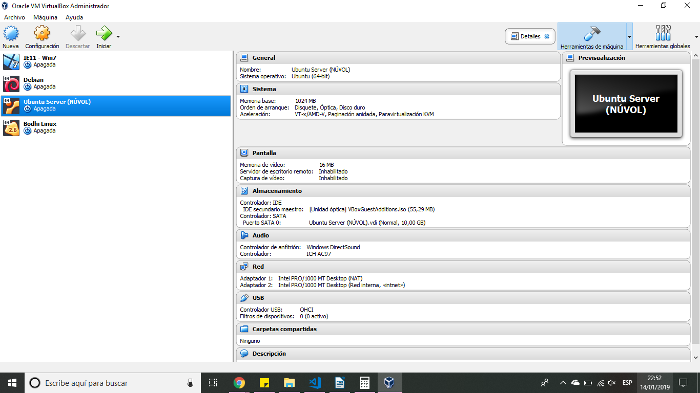
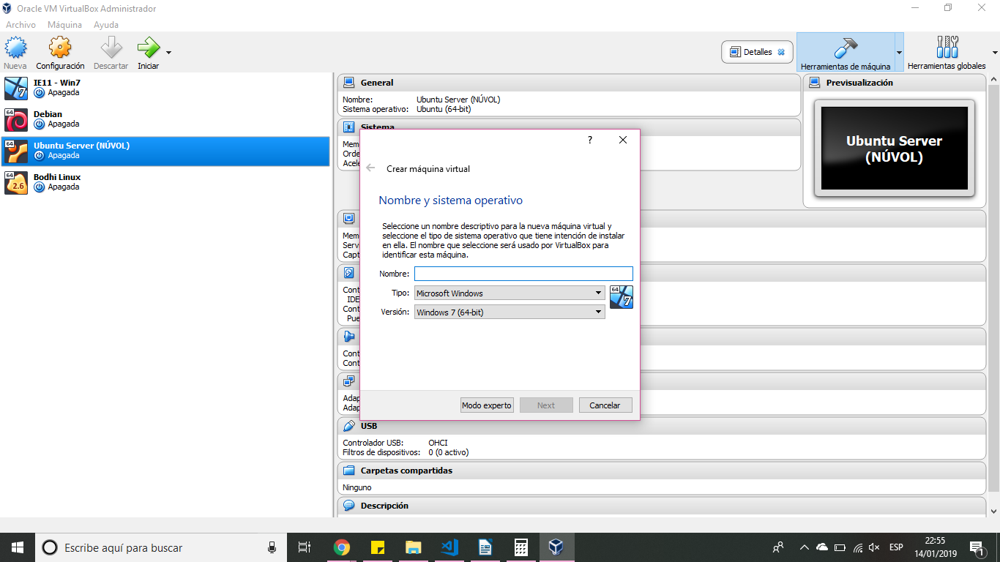
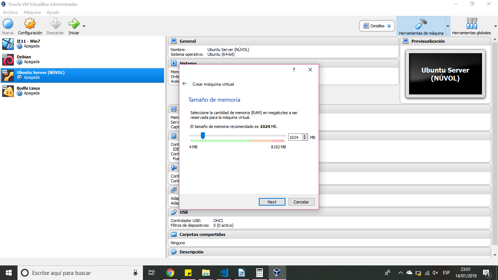
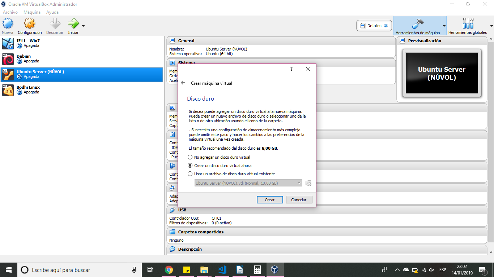
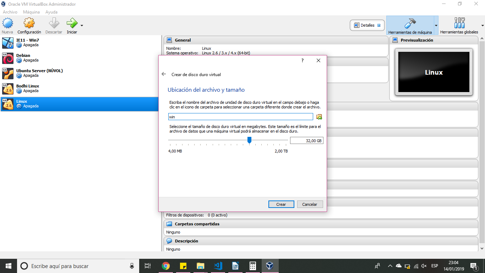
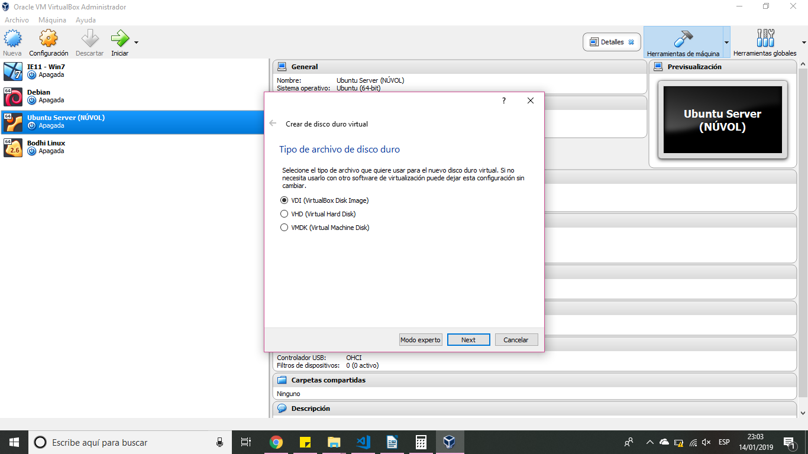
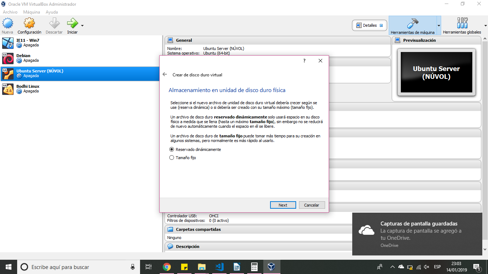

===========================================================================
CREACIÓ I INSTAL·LACIÓ D'UNA MÀQUINA VIRTUAL EN VIRTUALBOX PER REBECA SARAC
===========================================================================

.. sectnum::

.. contents:: Continguts

Introducció a VirtualBox
~~~~~~~~~~~~~~~~~~~~~~~~~

Oracle VM VirtualBox és un programari de virtualització per arquitectures x86/amd64. Actualment és desenvolupat per Oracle Corporation com a part de la seva família de productes de virtualització.

Instal·lació de VirtualBox
~~~~~~~~~~~~~~~~~~~~~~~~~~~
El primer que hem de fer, si no ho hem fet abans, és instal·lar VirtualBox en el nostre sistema. Hem de descarregar la versió corresponent al nostre sistema operatiu des de la seva pàgina web principal: https://www.virtualbox.org/.

Un cop descarregat, l'instal·lem seguint els passos per defecte.

Creació de la màquina virtual
~~~~~~~~~~~~~~~~~~~~~~~~~~~~~~~~

Un cop instal·lat VirtualBox en el nostre sistema, l'executem i veurem una finestra semblant a la següent.

    
Per crear una màquina virtual nova premem sobre el botó "Nova" i ens apareixerà l'assistent.

Triarem el sistema operatiu que voldrem instal·lar posteriorment. Podem posar-li el nom que vulguem i triar tant un fabricant (Microsoft, Apple, Linux, Oracle, etc) com la versió del sistema operatiu (Windows 7, Windows 8, etc).

En el següent pas hem de triar la memòria RAM que volem assignar al sistema operatiu. 

    
Després configurem el disc dur virtual de la màquina.

Podem triar si crear la màquina sense un disc dur, crear un disc dur virtual nou o carregar un disc dur ja existent. 
En aquest cas crearem un disc dur nou.

Seguidament, afegim l'ubicació i la mida que tindrà el nostre disc dur.

A continuació marquem el tipus de disc dur. Segons l'opció triada, ens permetrà obrir-lo amb altres programes de virtualització o no.

Finalment, podrem triar quina opció d'emmagatzematge en el disc dur físic desitgem. 
Si triem en dinàmic, la mida anirà augmentant segons augmenti l'espai ocupat en la màquina virtual, en canvi, si triem en mida fixa, el disc dur ocuparà l'espai total assignat al nostre disc físic.

Premem sobre el botó "Crear" i ja tindrem la nostra màquina virtual creada i llista per funcionar en VirtualBox.